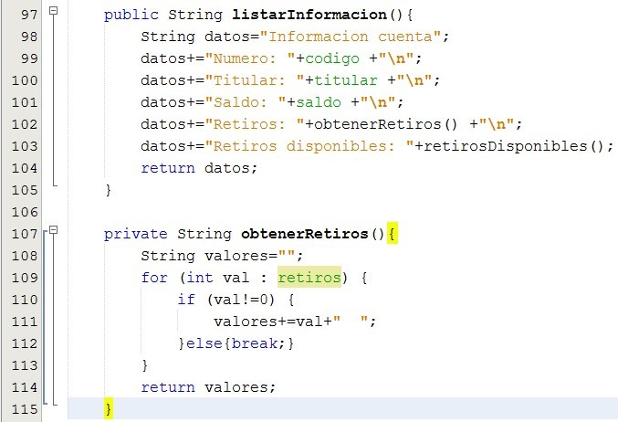

# CuentaBancoPoo
Creación de una cuenta de banco con el lenguaje de programación Java con POO (programación orientada a objetos). Faltan algunas imagenes pero todo el codigo está completo en el repocitorio.

Estructura del Proyecto 

Estructura de la clase Cuenta

Constructores de la clase

Getters y Setters de la clase

Método Consignar

Método Retirar

Método Retiros Disponibles

Listar Información y Obtener Retiros

Estructura de la clase Gestionar cuenta

Método Iniciar

Registrar Cuenta

Retirar Cuenta

Validar

Main

